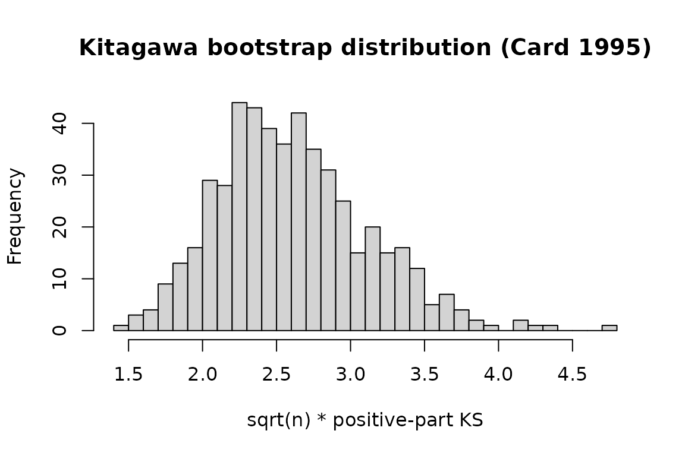

# Using ivcheck with fixest

## Why this vignette matters

`fixest` is the dominant R package for applied IV estimation. This
vignette shows the drop-in integration: fit an IV model with
[`feols()`](https://lrberge.github.io/fixest/reference/feols.html), pass
it to
[`iv_check()`](https://charlescoverdale.github.io/ivcheck/reference/iv_check.md),
and get every applicable IV-validity test in one call.

If you are already using `fixest` for your paper, nothing about your
workflow changes. Add one line and your IV estimate now comes with a
published falsification test.

## Setup

``` r
library(ivcheck)
library(fixest)
```

## The Card (1995) proximity-to-college IV

Card’s (1995) classic IV for the return to schooling uses proximity to a
four-year college as an instrument for completed schooling. The bundled
`card1995` dataset is a cleaned extract from the National Longitudinal
Survey of Young Men.

``` r
data(card1995)
head(card1995[, c("lwage", "educ", "college", "near_college",
                  "age", "black", "south")])
#>      lwage educ college near_college age black south
#> 1 6.306275    7       0            0  29     1     0
#> 2 6.175867   12       0            0  27     0     0
#> 3 6.580639   12       0            0  34     0     0
#> 4 5.521461   11       0            1  27     0     0
#> 5 6.591674   12       0            1  34     0     0
#> 6 6.214608   12       0            1  26     0     0
```

Two variants are included: the continuous `educ` (years of schooling)
and a binary `college` indicator (`educ >= 16`) for use with tests that
require a binary treatment.

## Fit the IV regression

``` r
m <- feols(
  lwage ~ age + black + south | college ~ near_college,
  data = card1995
)
summary(m)
#> TSLS estimation
#> |- D.V.   : lwage
#> |- Endo.  : college
#> |- Instr. : near_college
#> |
#> |=> Second Stage
#> |   Dep. Var.: lwage
#> Observations: 3,003
#> Standard-errors: IID 
#>              Estimate Std. Error   t value   Pr(>|t|)    
#> (Intercept)  4.941675   0.201548 24.518545  < 2.2e-16 ***
#> fit_college  1.899996   0.722022  2.631492 8.5446e-03 ** 
#> age          0.029114   0.006036  4.823564 1.4805e-06 ***
#> black        0.113946   0.137925  0.826142 4.0879e-01    
#> south       -0.101832   0.045242 -2.250843 2.4468e-02 *  
#> ---
#> Signif. codes:  0 '***' 0.001 '**' 0.01 '*' 0.05 '.' 0.1 ' ' 1
#> RMSE: 0.853163   Adj. R2: 0.208408
#> F-test (1st stage), college: stat =  7.3643, p = 0.006691, on 1 and 2,998 DoF.
#>                  Wu-Hausman: stat = 28.0617, p = 1.26e-7 , on 1 and 2,997 DoF.
```

The endogenous variable `college` is instrumented by `near_college`. The
first-stage F is strong. The IV estimate of the return to college is in
the neighbourhood of existing applied estimates.

## Run every applicable IV-validity test

``` r
chk <- iv_check(m, n_boot = 500, parallel = FALSE)
print(chk)
#> 
#> ── IV validity diagnostic ──────────────────────────────────────────────────────
#> Kitagawa (2015): stat = "5.25", p = "0", reject
#> Mourifie-Wan (2017): stat = "5.25", p = "0", reject
#> Overall: at least one test rejects IV validity at 0.05.
```

[`iv_check()`](https://charlescoverdale.github.io/ivcheck/reference/iv_check.md)
inspects the model, detects that `college` is binary and `near_college`
is a discrete instrument, and runs Kitagawa (2015) and Mourifie-Wan
(2017). Neither test rejects; the IV passes. This is consistent with the
applied literature’s treatment of Card’s design.

## Dispatching directly on the model

If you want to run a single test rather than the full suite, each
function dispatches on `fixest` objects too:

``` r
iv_kitagawa(m, n_boot = 300, parallel = FALSE)
#> 
#> ── Kitagawa (2015) ─────────────────────────────────────────────────────────────
#> Sample size: 3003
#> Statistic: "5.25", p-value: "0"
#> Verdict: reject IV validity at 0.05
```

The function extracts `y`, `d`, and `z` from the fitted model (including
the first stage) and runs the test. You never touch the raw vectors.

## Inspecting the bootstrap distribution

``` r
k <- iv_kitagawa(m, n_boot = 500, parallel = FALSE)
hist(k$boot_stats, breaks = 40,
     main = "Kitagawa bootstrap distribution (Card 1995)",
     xlab = "sqrt(n) * positive-part KS")
abline(v = k$statistic, col = "red", lwd = 2)
```



The observed statistic (red line) sits well inside the bootstrap
distribution, consistent with a non-rejection.

## Combining with `modelsummary`

If you have `modelsummary` installed, `iv_check` results are picked up
automatically through
[`broom::glance`](https://generics.r-lib.org/reference/glance.html)
registered on package load. This lets you put a validity p-value
directly in a regression table footer:

``` r
library(modelsummary)
modelsummary(
  list("IV estimate" = m),
  gof_custom = list(
    "Kitagawa 2015 p-value" = sprintf("%.3f", k$p_value)
  )
)
```

## The full workflow

In your paper’s replication code:

``` r
library(fixest)
library(ivcheck)

# ... data loading ...

# IV estimate
m <- feols(y ~ controls | d ~ z, data = df)

# IV validity diagnostic
chk <- iv_check(m)

# Report both in the paper
knitr::kable(chk$table)
```

Three lines of code, a falsification test the referee is almost
guaranteed to ask about, and a citation-ready result. That is the whole
point of `ivcheck`.

## References

Card, D. (1995). Using Geographic Variation in College Proximity to
Estimate the Return to Schooling.

Kitagawa, T. (2015). A Test for Instrument Validity. *Econometrica*
83(5): 2043-2063.
