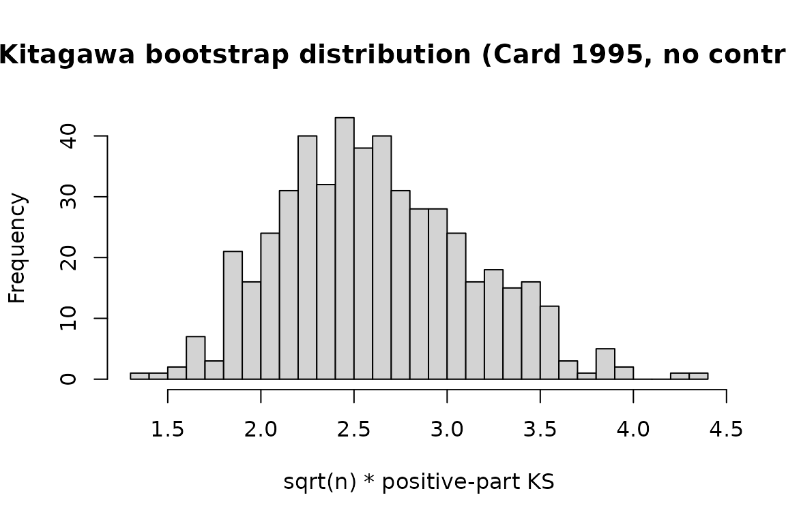

# Using ivcheck with fixest

## Why this vignette matters

`fixest` is the dominant R package for applied IV estimation. This
vignette shows the drop-in integration: fit an IV model with
[`feols()`](https://lrberge.github.io/fixest/reference/feols.html), pass
it to
[`iv_check()`](https://charlescoverdale.github.io/ivcheck/reference/iv_check.md),
and get every applicable IV-validity test in one call.

If you are already using `fixest` for your paper, nothing about your
workflow changes. Add one line and your IV estimate now comes with a
published falsification test.

## Setup

``` r

library(ivcheck)
library(fixest)
```

## The Card (1995) proximity-to-college IV

Card’s (1995) classic IV for the return to schooling uses proximity to a
four-year college as an instrument for completed schooling. The bundled
`card1995` dataset is a cleaned extract from the National Longitudinal
Survey of Young Men.

``` r

data(card1995)
head(card1995[, c("lwage", "educ", "college", "near_college",
                  "age", "black", "south")])
#>      lwage educ college near_college age black south
#> 1 6.306275    7       0            0  29     1     0
#> 2 6.175867   12       0            0  27     0     0
#> 3 6.580639   12       0            0  34     0     0
#> 4 5.521461   11       0            1  27     0     0
#> 5 6.591674   12       0            1  34     0     0
#> 6 6.214608   12       0            1  26     0     0
```

Two variants are included: the continuous `educ` (years of schooling)
and a binary `college` indicator (`educ >= 16`) for use with tests that
require a binary treatment.

## The unconditional case: no exogenous controls

We start with the simplest specification: no exogenous controls in the
structural equation. This is the case
[`iv_kitagawa()`](https://charlescoverdale.github.io/ivcheck/reference/iv_kitagawa.md)
is designed for.

``` r

m_uncond <- feols(
  lwage ~ 1 | college ~ near_college,
  data = card1995
)
summary(m_uncond)
#> TSLS estimation: Second stage
#> |- D.V.   : lwage
#> |- Endo.  : college
#> |- Instr. : near_college
#> Dep. Var.: lwage
#> Observations: 3,003
#> Standard-errors: IID 
#>             Estimate Std. Error  t value   Pr(>|t|)    
#> (Intercept)  5.65161   0.155590 36.32367  < 2.2e-16 ***
#> fit_college  2.24687   0.568671  3.95109 7.9588e-05 ***
#> ---
#> Signif. codes:  0 '***' 0.001 '**' 0.01 '*' 0.05 '.' 0.1 ' ' 1
#> RMSE: 0.996225   Adj. R2: 0.02591
#> F-test (1st stage), college: stat = 15.589, p = 8.052e-5, on 1 and 3,001 DoF.
#>                  Wu-Hausman: stat = 68.919, p < 2.2e-16 , on 1 and 3,000 DoF.
```

``` r

chk <- iv_check(m_uncond, n_boot = 500, parallel = FALSE)
print(chk)
#> 
#> ── IV validity diagnostic ──────────────────────────────────────────────────────
#> Kitagawa (2015): stat = "5.25", p = "0", reject
#> Mourifie-Wan (2017): stat = "5.25", p = "0", reject
#> Overall: at least one test rejects IV validity at 0.05.
```

[`iv_check()`](https://charlescoverdale.github.io/ivcheck/reference/iv_check.md)
inspects the model, detects that `college` is binary and `near_college`
is a discrete instrument, and runs Kitagawa (2015) and Mourifie-Wan
(2017). With no covariates the two are numerically identical
(Mourifie-Wan reduces exactly to the variance-weighted Kitagawa test,
unit-tested).

### Bootstrap distribution

``` r

k <- iv_kitagawa(m_uncond, n_boot = 500, parallel = FALSE)
hist(k$boot_stats, breaks = 40,
     main = "Kitagawa bootstrap distribution (Card 1995, no controls)",
     xlab = "sqrt(n) * positive-part KS")
abline(v = k$statistic, col = "red", lwd = 2)
```



## The conditional case: one exogenous control

Card’s identification strategy is more naturally read as “valid
*conditional on* demographic and regional controls”. In that setting the
right test is Mourifie and Wan’s (2017) conditional version: same
testable family of inequalities as Kitagawa, but the conditional CDFs
are estimated by series regression on `X` rather than treated as
unconditional.

In `ivcheck` v0.1.2, the conditional path supports a single covariate
(multivariate via tensor-product basis is planned for v0.2.0).

``` r

m_cond <- feols(
  lwage ~ age | college ~ near_college,
  data = card1995
)
```

[`iv_kitagawa()`](https://charlescoverdale.github.io/ivcheck/reference/iv_kitagawa.md)
is strictly the unconditional test and refuses fitted models that carry
controls:

``` r

iv_kitagawa(m_cond, n_boot = 100, parallel = FALSE)
#> Error in `abort_if_controls_present()`:
#> ! `iv_kitagawa()` is the unconditional Kitagawa (2015) test; it does not
#>   condition on controls.
#> ✖ Your fitted model has 1 exogenous control(s): 'age'.
#> ℹ Use `iv_mw()` on the same model for the conditional Mourifie-Wan (2017) test.
#> ℹ To force the unconditional test on these data, call `iv_kitagawa()` on raw
#>   `(y, d, z)` vectors.
```

The conditional test is
[`iv_mw()`](https://charlescoverdale.github.io/ivcheck/reference/iv_mw.md).
Dispatched on the same fitted model, it picks up the single covariate
automatically and runs the Chernozhukov-Lee-Rosen series-regression test
with Andrews-Soares adaptive moment selection:

``` r

mw <- iv_mw(m_cond, n_boot = 200, parallel = FALSE)
print(mw)
#> 
#> ── Mourifie-Wan (2017) ─────────────────────────────────────────────────────────
#> Sample size: 3003
#> Statistic: "79.5", p-value: "0.675"
#> Verdict: cannot reject IV validity at 0.05
```

[`iv_check()`](https://charlescoverdale.github.io/ivcheck/reference/iv_check.md)
does the right thing automatically: it detects that the model has
controls, drops Kitagawa from the applicable list with an informational
message, and reports MW alone:

``` r

iv_check(m_cond, n_boot = 200, parallel = FALSE)
#> ℹ Kitagawa test skipped: fitted model has exogenous controls and
#>   `iv_kitagawa()` is unconditional.
#> ℹ The conditional Mourifie-Wan test is the right object here.
#> 
#> 
#> ── IV validity diagnostic ──────────────────────────────────────────────────────
#> 
#> Mourifie-Wan (2017): stat = "79.5", p = "0.695", pass
#> 
#> Overall: cannot reject IV validity at 0.05.
```

## Multivariate controls

When the structural equation carries more than one exogenous control,
[`iv_mw()`](https://charlescoverdale.github.io/ivcheck/reference/iv_mw.md)
in v0.1.2 does not yet support the multivariate conditioning required
for a valid conditional test. Both Kitagawa and MW are skipped, and
[`iv_check()`](https://charlescoverdale.github.io/ivcheck/reference/iv_check.md)
reports back with informational messages:

``` r

m_multi <- feols(
  lwage ~ age + black + south | college ~ near_college,
  data = card1995
)
iv_check(m_multi, n_boot = 100, parallel = FALSE)
#> ℹ Kitagawa test skipped: fitted model has exogenous controls and
#>   `iv_kitagawa()` is unconditional.
#> ℹ The conditional Mourifie-Wan test is the right object here.
#> ℹ Mourifie-Wan test skipped: multivariate `X` (>1 control) is not yet supported
#>   in v0.1.2.
#> ℹ Planned for v0.2.0 via tensor-product series basis.
#> ℹ Workaround: reduce `X` to a single propensity index and call `iv_mw()`
#>   directly.
#> Error in `iv_check()`:
#> ! Could not detect an applicable IV-validity test for this model.
#> ℹ The model does not appear to be an IV model, or the treatment is not binary.
#> ℹ Supported: `fixest::feols()` with formula `y ~ x | d ~ z` or
#>   `ivreg::ivreg()`.
```

Multivariate conditioning via tensor-product series basis is planned for
v0.2.0. Until then, two workarounds:

1.  **Reduce `X` to a single index.** Fit a propensity score
    `Pr(D = 1 | X)` or another scalar summary of the controls, then
    refit the IV model with that index as the single exogenous control
    and call
    [`iv_mw()`](https://charlescoverdale.github.io/ivcheck/reference/iv_mw.md)
    on the result.
2.  **Stratify and run unconditional tests within strata.** Coarsely bin
    `X` and call
    [`iv_kitagawa()`](https://charlescoverdale.github.io/ivcheck/reference/iv_kitagawa.md)
    on raw vectors within each cell, applying a Bonferroni adjustment
    across cells.

## Combining with `modelsummary`

If you have `modelsummary` installed, `iv_check` results are picked up
automatically through
[`broom::glance`](https://generics.r-lib.org/reference/glance.html)
registered on package load. This lets you put a validity p-value
directly in a regression table footer:

``` r

library(modelsummary)
modelsummary(
  list("IV estimate" = m_cond),
  gof_custom = list(
    "Mourifie-Wan 2017 p-value" = sprintf("%.3f", mw$p_value)
  )
)
```

## The full workflow

In your paper’s replication code:

``` r

library(fixest)
library(ivcheck)

# ... data loading ...

# IV estimate (conditional on a single control)
m <- feols(y ~ x | d ~ z, data = df)

# IV validity diagnostic
chk <- iv_check(m)

# Report both in the paper
knitr::kable(chk$table)
```

Three lines of code, a falsification test the referee is almost
guaranteed to ask about, and a citation-ready result. That is the whole
point of `ivcheck`.

## References

Card, D. (1995). Using Geographic Variation in College Proximity to
Estimate the Return to Schooling.

Kitagawa, T. (2015). A Test for Instrument Validity. *Econometrica*
83(5): 2043-2063.

Mourifie, I. and Wan, Y. (2017). Testing Local Average Treatment Effect
Assumptions. *Review of Economics and Statistics* 99(2): 305-313.
